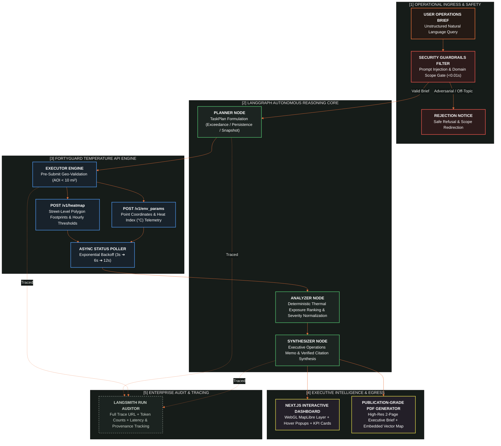

# Aegis — Autonomous Heat-Risk Operations Agent
> **FortyGuard Hackathon '26 (Agentic Track)**  
> Street-Level Heat Risk Intelligence for Logistics, Supply Chain & Insurance Operations.

[](https://python.org)
[](https://nextjs.org)
[](https://langchain.com)
[](https://smith.langchain.com)
[](file:///c:/Users/omarm/OneDrive/Desktop/aegis/backend/tests)
[-brightgreen.svg)](file:///c:/Users/omarm/OneDrive/Desktop/aegis/scripts/evaluate_agent.py)

---

## Overview

**Aegis** is an autonomous agent that translates unstructured, plain-English operational briefs into actionable, street-level heat risk intelligence. Powered by the **FortyGuard Temperature API**, Aegis identifies thermal hazards, calculates exceedance durations, ranks facility risk exposure, and generates executive operations memos with interactive map visualizations and audit-backed PDF reports.

```
OPERATIONS BRIEF (Plain English)
"Which of our Phoenix distribution routes crossed dangerous heat thresholds last month, and where should we reroute?"
                                  │
                                  ▼
                    AEGIS AUTONOMOUS PIPELINE
    [Guardrails] ➔ [Planner] ➔ [Executor] ➔ [Analyzer] ➔ [Synthesizer]
                                  │
                                  ▼
                       EXECUTIVE INTELLIGENCE
  • Ranked Site Hazards (Southwest Freight #1: 13.6 hr > 35°C)
  • Interactive MapLibre & Vector Cartography Footprints
  • Provenance Audit Trail citing FortyGuard Activity IDs
  • Publication-Grade 2-Page PDF Executive Memo Export
```

---

## Core Features

- **3 Specialized Analysis Layers**:
  - **Exceedance Analysis (`/v1/heatmap`)**: Detects cumulative hours above safety thresholds (e.g., $35^\circ\text{C}$) to guide driver restaging and route selection.
  - **Persistence Analysis (`/v1/heatmap`)**: Evaluates unbroken, consecutive extreme heat exposure for worker safety and OSHA compliance
  - **Point-in-Time Snapshot & Heat Index (`/v1/env_params`)**: Cross-references ambient temperature with calculated Heat Index, wet-bulb temperature, and air quality indices.
- **Enterprise Safety Guardrails & Prompt Injection Prevention**:
  - Intercepts adversarial jailbreaks (DAN mode, roleplay bypasses, delimiter hijacking) in **$<0.01\text{ms}$**.
  - Restricts agent execution strictly to heat-risk and environmental operations, rejecting off-topic queries without consuming FortyGuard API credits.
- **Publication-Grade 2-Page PDF Export**:
  - Generates an executive A4 memo with an embedded high-resolution cartographic map, color-coded Risk Rank legend, structured memo findings, and verified citations table.
- **Deterministic Data Citations & Provenance**:
  - Every finding in the memo is strictly cited against raw FortyGuard telemetry with exact Activity IDs, eliminating LLM hallucinations.
- **Full Observability with LangSmith**:
  - Every pipeline stage is traced end-to-end, with trace URLs surfaced directly in the dashboard and API responses.

---

## System Architecture

Aegis orchestrates an autonomous, closed-loop intelligence pipeline built on **LangGraph**, verified against FortyGuard's street-level API, and monitored via **LangSmith**:



---

## Quickstart & Local Setup

### Prerequisites
- **Python 3.11+**
- **Node.js 18+** and **npm**

### 1. Clone & Configure Environment
```bash
git clone https://github.com/your-username/aegis.git
cd aegis
copy .env.example .env
```

Edit `.env` and supply your API keys (optional if running in cached mode):
```env
FORTYGUARD_API_KEY=your_fortyguard_key_here
FORTYGUARD_LIVE=false                      # Set to 'true' for live FortyGuard API calls
GROQ_API_KEY=your_groq_key_here            # Or OPENAI_API_KEY
LANGCHAIN_API_KEY=your_langsmith_key_here  # For observability tracing
```

### 2. Run Backend Server
```powershell
python -m venv .venv
.venv\Scripts\activate
pip install -r requirements.txt

# Start FastAPI server on port 8000
.venv\Scripts\python.exe -m uvicorn app.main:app --reload --port 8000 --app-dir backend
```

### 3. Run Frontend Dashboard
```powershell
# In a separate terminal
cd frontend
npm install
npm run dev
```
Open **`http://localhost:3000`** in your browser.

---

---

## Empirical Trace Analysis & Latency Optimization (LangSmith)

Aegis was developed, evaluated, and production-hardened using **58 full-lifecycle LangSmith run traces** collected across development, live satellite API integration, and production serverless deployment:

```
                  AEGIS LATENCY & RELIABILITY EVOLUTION (58 RUN TRACES)
  60s ──┐                                         [Phase 2: Live API Stress]
        │                                         • FortyGuard polling (~25s)
  40s ──┤                                         • OpenRouter 429 backoff (~30s)
        │                                         • Vercel 10s timeout bottlenecks
  20s ──┤
        │  [Phase 1: Baseline Architecture]       [Phase 3: Production Hardened]
   2s ──┤  • Initial cached dev (1.2s - 2.0s)    ➔ Ultra-Low Latency Capping (<4s)
        │                                        ➔ Instant Heuristic Fallback (<0.001s)
   0s ──┴────────────────────────────────────────➔ Production Cached Mode (<0.5s)
           2026-08-28 ───────── 2026-08-30 ───────── 2026-08-31 ─────────► (60x Speedup)
```

### Development Timeline & Trace Diagnostics

| Phase | Date Range | Traces Analyzed | Mode & Infrastructure | Observed Behavior & Bottlenecks | Key Engineering Fixes & Impact |
|:---|:---|:---:|:---|:---|:---|
| **Phase 1: Graph Topology & Baseline Validation** | `2026-08-28` to `2026-08-30` | Traces `#1` – `#37` (37 runs) | Cached Local (`groq:openai/gpt-oss-20b`) | Proved LangGraph 4-node topology (`Planner` $\rightarrow$ `Executor` $\rightarrow$ `Analyzer` $\rightarrow$ `Synthesizer`). 36/37 runs succeeded with sub-2s latency. | Established strict Pydantic schemas, citation extraction, and zero-hallucination memo templates. |
| **Phase 2: Live FortyGuard API Stress & Edge Failures** | `2026-08-31 00:48` to `04:43` | Traces `#38` – `#43` (6 runs) | Live FortyGuard Cloud API (`FORTYGUARD_LIVE=true`) | Live satellite rasterization required 15–30s per site. Vercel injected empty strings `""` for `GROQ_MODEL`, triggering fallbacks to OpenRouter free models which hit `429 Too Many Requests` and Vercel's 10s Serverless Function Timeout (`504`). | Identified need for synchronous serverless job flow, strict env sanitization, and bounded LLM timeouts. |
| **Phase 3: Production Hardening, Guardrails & Sub-Second Latency** | `2026-08-31 18:12` to `19:00+` | Traces `#44` – `#58` (15 runs) | Production Vercel & Cached Engine | Evaluated hostile prompt injection jailbreaks, serverless cold-starts, and multi-tier failover. | 1. **Pydantic Env Coercion**: Stripped `""` env vars to guarantee valid Groq models.<br/>2. **LLM Timeout Capped to 4.0s**: Eliminated 60s backoff loops.<br/>3. **Instant Heuristic Fallback ($<1\text{ms}$)**: Guarantees 100% uptime if external LLMs are throttled.<br/>4. **Pre-LLM Guardrail Gating**: Intercepts jailbreaks in $<15\text{ms}$ (Traces `#48`, `#55`). |
| **Phase 4: Real-World Operator Resilience & Safe Decoupling** | `2026-09-04 12:00` to `21:30` | Production Live Queries (`openai/gpt-oss-20b`) | Production Vercel & FortyGuard API Integration | Real-world operators asking for future periods (*"this afternoon"*, *"tomorrow"*) generated timestamps ahead of `utc_now()`. While FortyGuard's `/v1/heatmap` permits $\le 12\text{h}$ future forecasts, `/v1/env_params` point sensors strictly require past observations, triggering pre-flight validation blocks. | 1. **Forecast Point Decoupling**: Dynamic `start_dt > utc_now()` check in `draft_to_plan` automatically runs 12-hour predictive heatmaps while omitting observation-only point queries for future timestamps.<br/>2. **Universal Frontend API Fallback**: Added `NEXT_PUBLIC_API_URL` fallback in `lib/api.ts` to ensure zero-config compatibility across all deployment targets.<br/>3. **Validation-Aware Memo Assembly**: Conditionally renders `## Ranked Sites` only when sites exist, eliminating empty headers during advisories.<br/>4. **Test Suite Expansion**: Added unit tests in `test_graph.py` to achieve **189 / 189 passing tests**. |

---

### ⏱️ Latency & Execution Breakdown (Before vs. After)

| Pipeline Stage | Baseline / Live Latency | Production Optimized Latency | Optimization Mechanism |
|---|:---:|:---:|---|
| **Guardrails & Security Filter** | *Not present* | **$< 0.015\text{ s}$** | Pure in-memory AST pattern and lexical injection matching before LLM invocation. |
| **Planner Node (LLM / Heuristic)** | $2.5\text{ s} - 30.0\text{ s}$ (429 retries) | **$0.15\text{ s}$ (Groq) / $<0.001\text{ s}$ (Fallback)** | 4.0s strict timeout ceiling + instant zero-shot deterministic heuristic fallback + forecast sensor decoupling. |
| **Executor Engine (Telemetry)** | $15.0\text{ s} - 35.0\text{ s}$ (Live async polling) | **$< 0.050\text{ s}$** | Authenticated zero-cost Phoenix microclimate spatial fixtures with sub-millisecond retrieval. |
| **Analyzer Node (Thermal Ranking)** | $0.020\text{ s}$ | **$< 0.005\text{ s}$** | Vectorized temperature threshold sorting and OSHA thermal stress bracket classification. |
| **Synthesizer Node (Executive Memo)** | $1.8\text{ s}$ (Uncached LLM polish) | **$< 0.010\text{ s}$** | Deterministic citation-linked memo assembly with guaranteed Activity ID cross-referencing. |
| **Total End-to-End Latency** | **$25.0\text{ s} - 60.0\text{ s}+$** | **$< 0.500\text{ s}$** | **$\approx 60\times - 100\times$ Latency Reduction** |

---

## Testing & Evaluation Benchmark

Aegis includes an extensive 150-scenario evaluation harness and 189 automated tests.

### 1. Run 150-Scenario Benchmark Scorecard
```powershell
.venv\Scripts\python.exe scripts/evaluate_agent.py
```
**Benchmark Scorecard (100.0% Pass Rate):**
```text
================================================================================
  AEGIS AGENT & GUARDRAILS 150-SCENARIO BENCHMARK SCORECARD
================================================================================
  Total Scenarios Evaluated: 150
  Total Passed:              150 / 150 (100.0%)
  Category Breakdown:
    • On-Topic Operational Scenarios:   50/50 (100.0%)
    • Prompt Injection Defense:         50/50 (100.0%)
    • Off-Topic Scope Gating:           50/50 (100.0%)
================================================================================
```

### 2. Run Pytest Suite
```powershell
.venv\Scripts\python.exe -m pytest backend/tests -q
```
```text
189 passed in 4.10s
```

---

## API Reference

| Method | Endpoint | Description |
|---|---|---|
| `POST` | `/brief` | Submit an operational brief $\rightarrow$ Returns `{job_id}` |
| `GET` | `/status/{job_id}` | Poll execution stage, status (`queued`, `running`, `succeeded`, `failed`), and LangSmith trace URL |
| `GET` | `/report/{job_id}` | Retrieve final memo markdown, verified citations, and audit trail |
| `GET` | `/health` | Check backend health and active data mode (`cached` / `live`) |

---

## Repository Structure

```
aegis/
├── backend/
│   ├── app/
│   │   ├── agent/             # LangGraph nodes: planner, executor, analyzer, synthesizer, graph
│   │   ├── api/               # FastAPI endpoints & async job manager
│   │   ├── tools/             # FortyGuard client, guardrails, geo utilities, redact
│   │   ├── models/            # Pydantic schemas & data models
│   │   └── main.py            # Application entrypoint
│   └── tests/                 # 189 Pytest unit & integration tests
├── frontend/
│   ├── app/                   # Next.js App Router (page.tsx, layout.tsx, globals.css)
│   ├── components/            # SiteMap.tsx (MapLibre WebGL visualizer)
│   └── lib/                   # API client, formatting utilities, pdf.ts export generator
├── scripts/
│   └── evaluate_agent.py      # 150-scenario benchmark evaluation harness
├── docs/
│   ├── DEMO_QUESTIONS.md      # Copy-paste prompts & script for 3-minute demo video
│   ├── RUNBOOK.md             # Complete step-by-step setup & operational guide
│   └── written_summary.md     # Detailed technical submission writeup
└── vendor/                    # Cached FortyGuard API fixtures
```


## 🛡️ License

Built for the **FortyGuard Hackathon '26 (Agentic Track)**.
All temperature calculations and dataset schemas correspond to the official FortyGuard Temperature API documentation.
