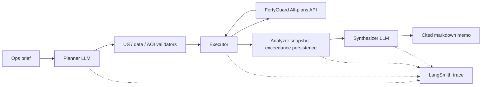

# Architecture

Aegis is a four-node LangGraph agent on FastAPI, with a Next.js client.

## Increment 1 (current)

- `FortyGuardClient` adapter with official-package hook + documented HTTP fallback
- Pre-submit geo/date/AOI validation (saves credits)
- Executor: submit → poll with 3s/6s/12s backoff → timeout; retries on 429/5xx
- Mocked pytest coverage for those paths

## FortyGuard constraints we enforce

- United States only (CONUS, Alaska, Hawaii, Puerto Rico boxes)
- Dates from 2021-01-01 (handbook floor; public docs allow 2019-01-01)
- Heatmap forecast ≤ 12 hours ahead
- AOI cap via `FORTYGUARD_MAX_AOI_MI2` (default 10; Premium docs allow 50 / ~130 km²)
- Granularity in `{60, 80, 100}` meters
- `env_params.analysis` length ≤ 3 until Premium is confirmed

## Discrepancies to resolve with the participant quickstart

1. Public docs list heatmap `filter_type` 1–4 (limitations page says 1–3). Handbook lists 1–5 including “single month”. Adapter accepts 1–5; live calls should stay on 1–3 until the key proves otherwise.
2. Credits: handbook + release notes specify `POST /v1/system/fetch-api-key-usage`; the docs UI page is a GET form. We POST `{}` until the quickstart shows the real body.
3. `env_params` requires a `temperature` (°C) on submit. We will take it from a heatmap tile or the brief, not invent it.
